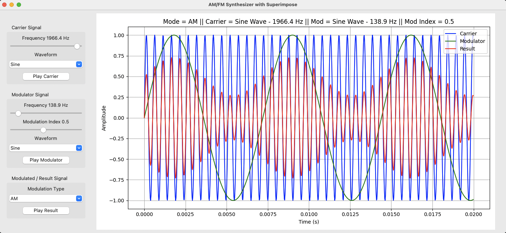

# python-fm-synth

FM/AM synthesiser written in Python with a Tkinter GUI. Set the carrier and modulator waves and visualise and hear the output.

## What it does

- Create a carrier wave and a modulator wave.
- Apply frequency or amplitude modulation to the carrier wave using the modulator wave, or superimpose the two.
- Visualise the carrier, modulator and resulting combination waveform.
- Audio playback of the carrier, modulator and resulting combination waveform.

## Requirements

- Python 3.13 or later
- numpy
- scipy
- matplotlib
- sounddevice

Install with:

    pip install numpy scipy matplotlib sounddevice
    
## How to run

    python fm-am-synth.py
    
## Screenshot

